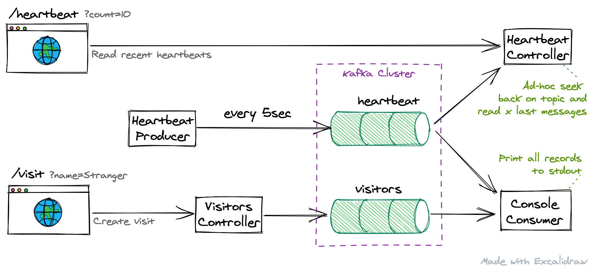

# Kafka Demo

Simple Kafka Demo demonstrating implementing Kafka Producer and Consumer with web interface.



# Configuration
Configuration is done using Spring Boot Autoconfig. See `src/main/resources/application.properties` and `HELP.md`

# Runnning
```
./gradlew bootRun
```

# Building for distribution
```
./gradlew bootJar
```